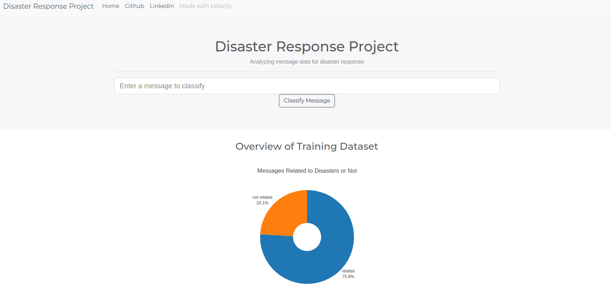

<h1> Disaster Response Pipeline Project </h1>

- [Context](#context)
  - [Files in the repository](#files-in-the-repository)
- [Instructions](#instructions)
- [Interface](#interface)
- [Acknowledgments](#acknowledgments)

# Context
This project was developed together with Udacity and Figure Eight to address a problem related to classifying messages in an event of a disaster context. 
It is complicated to know to which organization to communicate each type of emergency, and this difficulty can delay the assistance and rescue of those in need. The flooding of messages on social media or even in contact channels requires the work of identifying the main subject of each case and communicating with the appropriate organization. Thus, this project has the purpose of helping categorize messages in the way of indicating the main topic related to each message and then making it easier to identify which organization must take the lead in a specific case.

The project consists of a Flask app using an NLP machine learning pipeline to classify emergency messages.

It is composed of three stages:
1. Data cleaning pipeline: it takes disaster messages' historical data, cleans it, and saves it in a database.
2. NLP pipeline: reads the historical data from the database, trains an NLP model, and saves. 
3. Flask app: an interface where users can see historical data statistics and classify their messages.

## Files in the repository
Repository structure:

- _readme
  - interface_go.png
  - interface_home.png
- app
  - templates
    - go.html
    - master.html
  - run.py
- data
  - disaster_categories.csv
  - disaster_messages.csv
  - process_data.py
- models
  - train_classifier.py
- .gitignore
- README.md
- requirements.txt

The `_readme` folder contains the images used in the `README.md` file.

The `app` folder contains the files related to the Flask app inside the `templates` folder and the file `run.py` which is responsible to execute the app.

The `data` folder contains the .csv files containing the data used to train and evaluate the model and the file `process_data.py` which is responsible to process the data and store it in a database.

The `models` folder contains the file `train_classifier.py` which is responsible to train and evaluate the model and store it in a pickle file.

The repository also contains the files: `.gitignore` which establishes which files and directories must be ignored by Git; `README.md` which brings these instructions; and `requirements.txt` which has the required libraries to reproduce this project.

# Instructions
Follow the guidelines below to run the app:

1. It's recommended to start a virtual environment.

2. Clone this repository: 
   `git clone git@github.com:TamirisCrepalde/disaster-response-pipeline.git`.

3. Install the required libraries by running the command: `pip install -r requirements.txt`.

4. Run the ETL pipeline that cleans the data and stores it on a database: `python data/process_data.py data/disaster_messages.csv data/disaster_categories.csv data/DisasterResponse.db`

5. Run the ML pipeline that trains the classifier and saves the model: `python models/train_classifier.py data/DisasterResponse.db models/classifier.pkl`.

6. Go to `app` directory: `cd app`.

7. Run the Flask app: `python run.py`.

8. Click the `PREVIEW` button to open the homepage.

# Interface
The home page of the Flask app has the following design:

After entering the message and clicking on the classifying button, the results are shown on the following page:

# Acknowledgments
This project was developed as part of the Udacity Data Scientist Nanodegree. The data used in the model training was provided by Figure Eight.